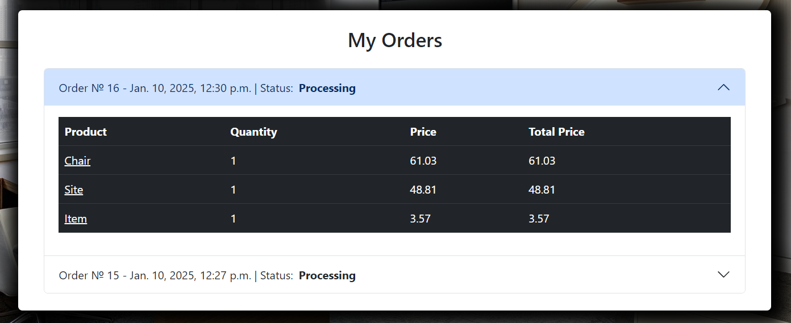

# Shop_project
A feature-rich **Django-based e-commerce platform** designed to provide seamless shopping experiences, robust order management, and efficient product handling.

## Features

### User Management
- **Authentication**: Secure login and logout with custom services.
- **Registration**: User-friendly signup with automatic login after successful registration.
- **Profile Management**: Edit user profiles, view order history, and leverage caching for performance.

### Catalog & Products
- **Product Listings**: Paginated catalog with category-based filtering and search functionality.
- **Detailed Views**: Comprehensive product information available for user review.

### Shopping Cart
- **Cart Management**: Add, update, and remove items effortlessly.
- **Real-Time Updates**: AJAX-powered cart for dynamic, on-the-fly adjustments.

### Orders
- **Order Placement**: Seamless checkout process with pre-filled user details.
- **Order History**: Accessible record of previous purchases in the user profile.

## Technical Details

- **Django Framework**: Clean and modular implementation using class-based views.
- **AJAX Integration**: Enhances cart and order features with real-time updates.
- **Service Layer Architecture**: Decoupled business logic for authentication, cart, and order operations.
- **Caching**: Boosts performance with user-specific cache management.
- **Responsive Design**: Ensures optimal usability across devices.

## Screenshots

Here are some screenshots that demonstrate key features of the platform:

### Homepage

*The homepage features the main product catalog, promotions, and quick links for customers to explore.*

### Product List

*The product listing page displays a variety of products with filter options for sorting and searching.*

### User Profile

*Users can view and update their personal information, as well as access their order history.*

### Order Example

*The order example page shows a completed order with payment and delivery details.*